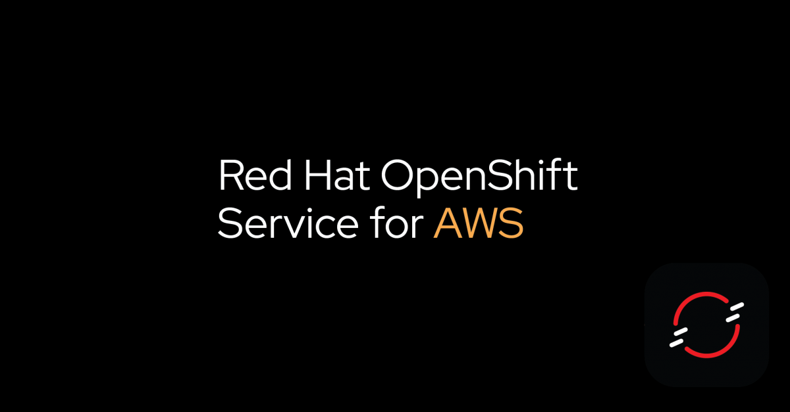

# Red Hat OpenShift Service for AWS (ROSA) Workshop

## Table of Contents
<!---
- [Prerequisite for workshop (Instructor Only)](prereq.md)
- Complex Cloud-Native Application with Live Flight Track Demo](liveflight.md)

--->

- [First Container (Pod) on ROSA](doc/deploywiths2i.md)
- [Basic ROSA Topology](doc/openshifttopology.md)
- [Basic ROSA Observability](doc/monitor.md)
- [Auto Scale Container with HPA](doc/scale.md)
- [OpenShift Serverless, auto scale up & down by event](doc/serverless.md)
- [Basic DevOps with Tekton](doc/tekton.md)

