# Auto Scale Container with HPA
<!-- TOC -->

- [Auto Scale Container with HPA](#auto-scale-container-with-hpa)
  - [Manual Scale Application](#manual-scale-application)
  - [Auto Scale Application](#auto-scale-application)
  - [Back to Table of Content](#back-to-table-of-content)

<!-- /TOC -->

## Manual Scale Application

- Back to Topology view, select Project : `<username>-lab1`

- click topology in left menu, click Duke icon (backend deployment), Details tab

- click increase ther pod count (^ icon) to 2 Pod

  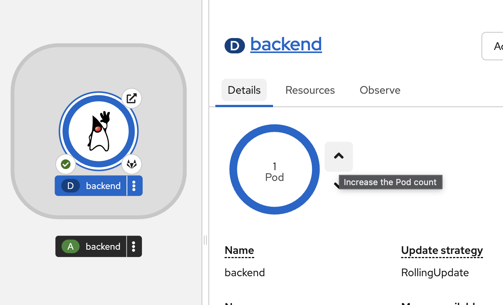 

- wait until application scale to 2 Pods (circle around Duke icon change to dark blue)

  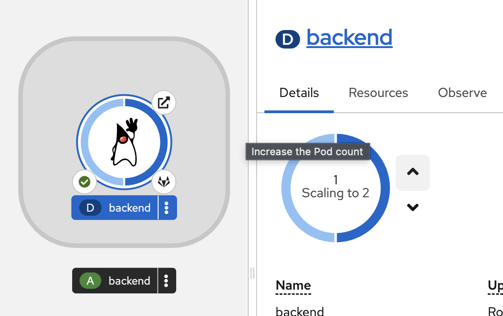 

  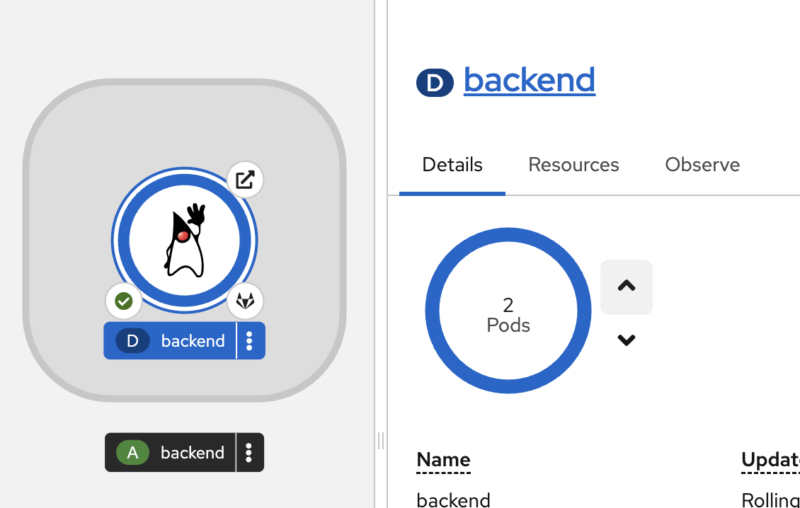 

- Wait a few minutes, util new pod ready to receive request!!! 

- Test load to application, go to web terminal, run below command 

  ```bash
  BACKEND_URL=https://$(oc get route backend -o jsonpath='{.spec.host}')
  while [  1  ];
  do
    curl $BACKEND_URL/backend
    printf "\n"
    sleep 10
  done
  ```
  
  example result, check have result from 2 pods (Host value)
  
  ```bash
  Backend version:v1, Response:200, Host:backend-95647fbb8-kt886, Status:200, Message: Hello, World
  Backend version:v1, Response:200, Host:backend-95647fbb8-q9dqv, Status:200, Message: Hello, World
  Backend version:v1, Response:200, Host:backend-95647fbb8-kt886, Status:200, Message: Hello, World
  Backend version:v1, Response:200, Host:backend-95647fbb8-q9dqv, Status:200, Message: Hello, World
  ```

- after few minute, type 'ctrl-c' in web terminal to terminated curl command

- go to Resources Tab, in Pods section, show 2 pods after scale

  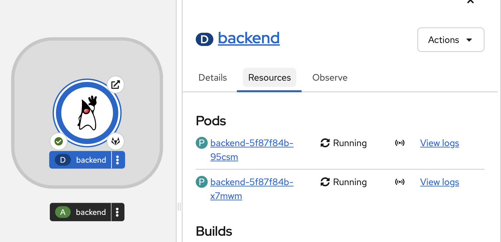 

- click 'View logs' of 1st Pod and 2nd Pod to confirm both pod are processed. 

  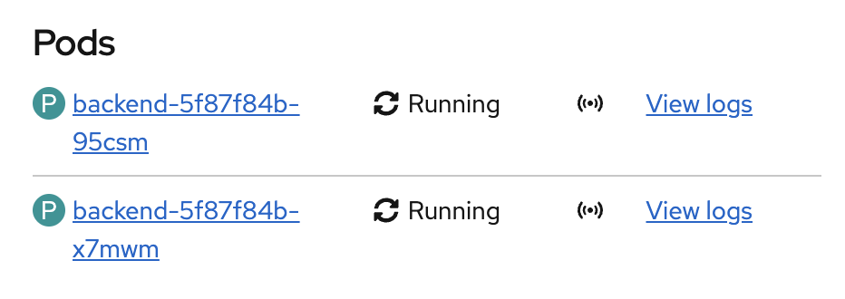 

  example of 1st pod

  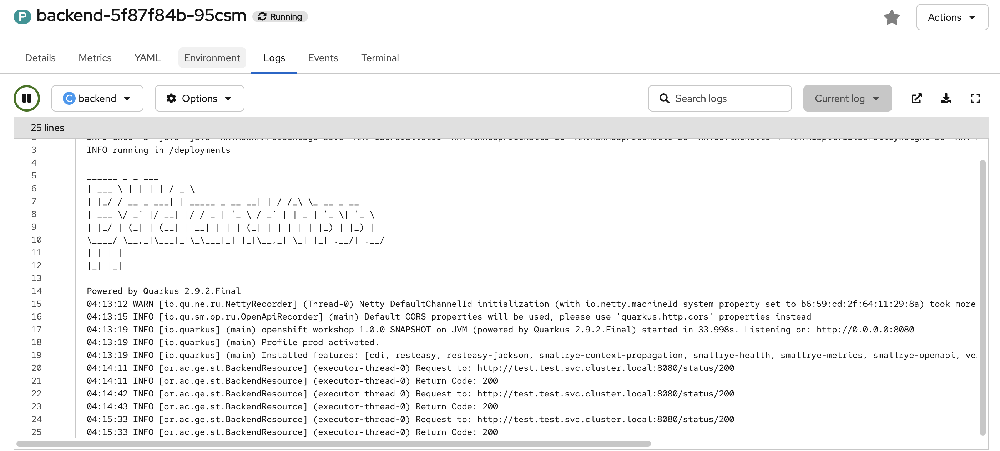 

  example of 2nd pod

  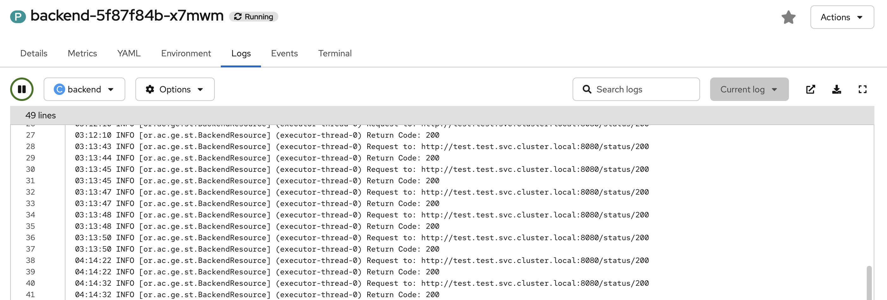 

- back to detail pages of backend deployment, scale pod to 0 (for this case, no pod for this application)

  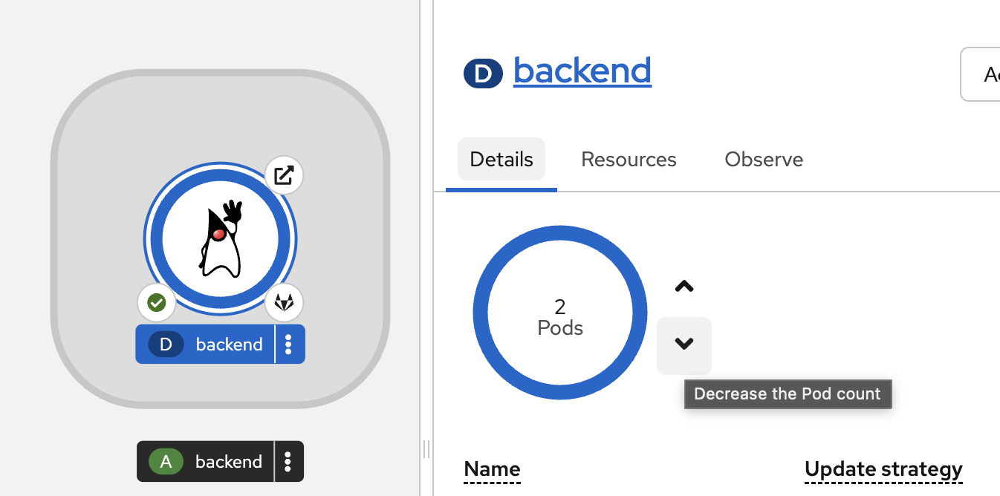  

  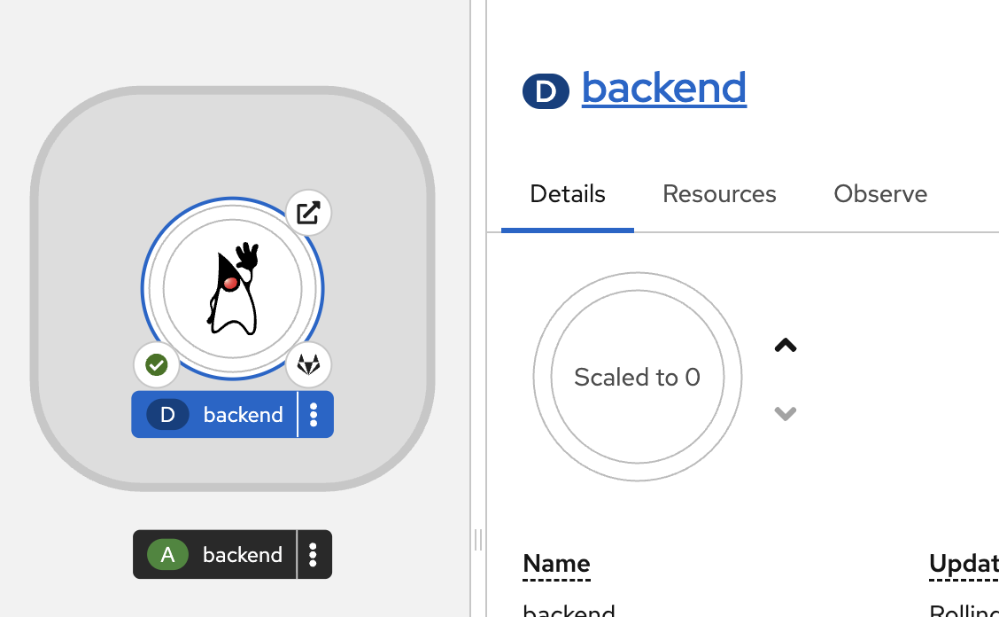 

- scale backend to 1 pod

  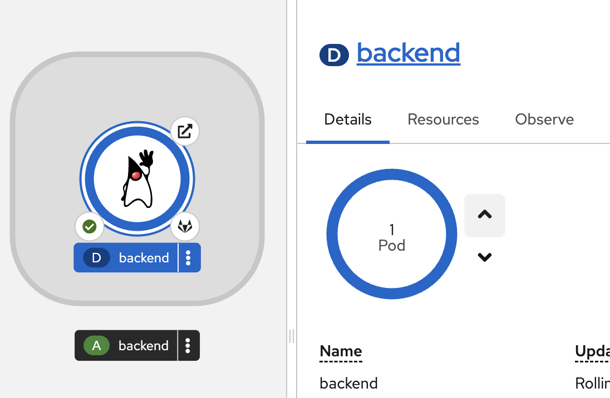 
   
## Auto Scale Application

In Kubernetes, a `HorizontalPodAutoscaler` automatically updates a workload resource (such as a Deployment or StatefulSet), with the aim of automatically scaling capacity to match demand.

Horizontal scaling means that the response to increased load is to deploy more Pods. This is different from vertical scaling, which for Kubernetes would mean assigning more resources (for example: memory or CPU) to the Pods that are already running for the workload.

If the load decreases, and the number of Pods is above the configured minimum, the HorizontalPodAutoscaler instructs the workload resource (the Deployment, StatefulSet, or other similar resource) to scale back down.

Horizontal pod autoscaling does not apply to objects that can't be scaled (for example: a DaemonSet.)

The HorizontalPodAutoscaler is implemented as a Kubernetes API resource and a controller. The resource determines the behavior of the controller. The horizontal pod autoscaling controller, running within the Kubernetes control plane, periodically adjusts the desired scale of its target (for example, a Deployment) to match observed metrics such as average CPU utilization, average memory utilization, or any other custom metric you specify.

- `HPA required resource request/limit to compare with utilization value`, before config HAP, recheck resource request/limit configuration

- Go to Topology, click at Duke icon for open backend deployment, click action dropdown menu, select Edit resource limits, check request/limit value.

   

- Go to Topology, click at Duke icon for open backend deployment, click action dropdown menu, select Add HorizontalPodAutoscaler
  
  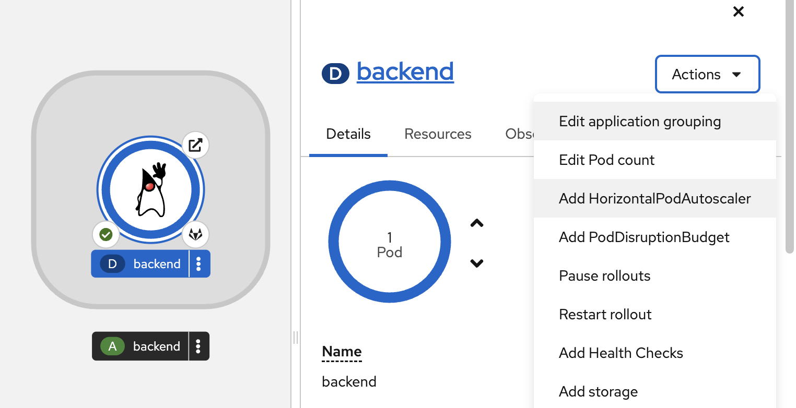 

- in Add HorizontalPodAutoscaler, set Name : `example`

- set Minimum Pods : 1

- set Maximum Pods : 3
  
- set CPU Utilization : 10%
  
- Don't set Memory Utilization
    
  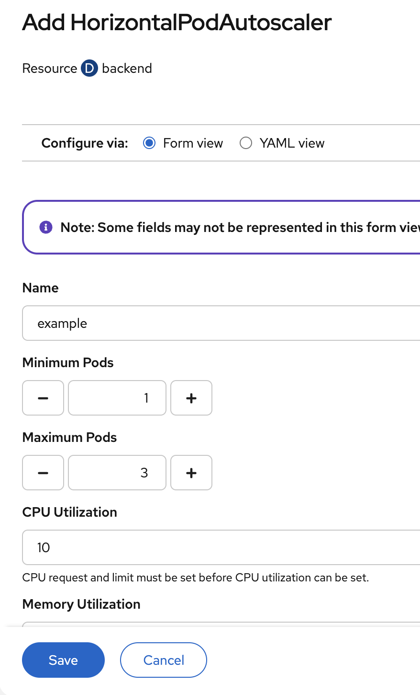 
    
- click save, and wait until backend deployment change to Autoscaling
  
  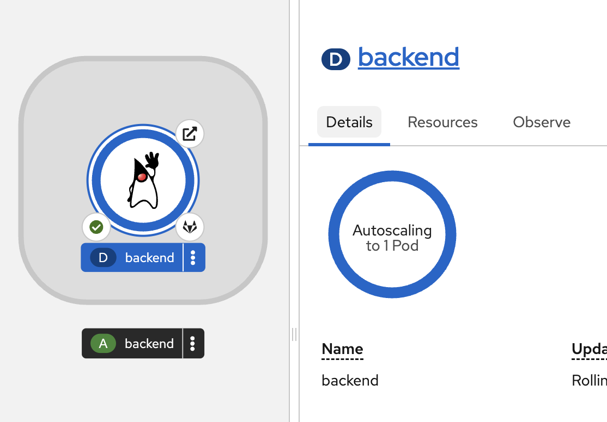 

- load test to backend application for proof auto scale
  
- go to web terminal

- run load test command

  ```bash
  BACKEND_URL=https://$(oc get route backend -o jsonpath='{.spec.host}')
  while [  1  ];
  do
    curl $BACKEND_URL/backend
    printf "\n"
  done
  ```

- click detail tab of backend deployment, wait until autoscaled to 3 (wait a few minutes)

  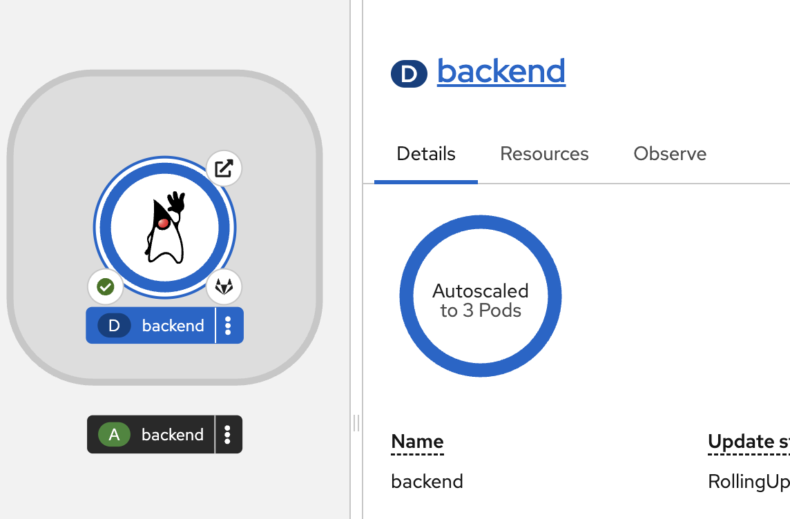 

- click resources tab, see 3 pods auto scale
  
  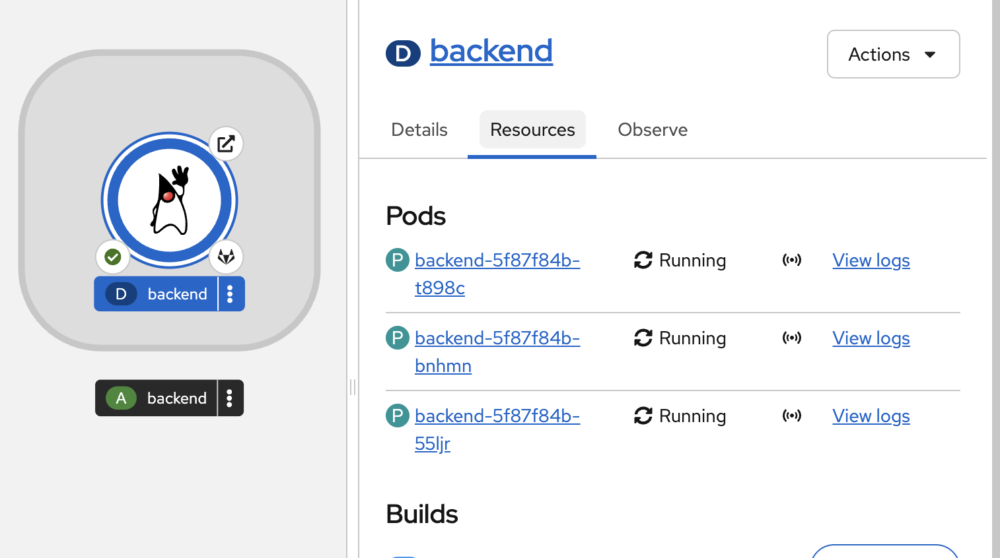 

- click Observe tab to view CPU usage 

  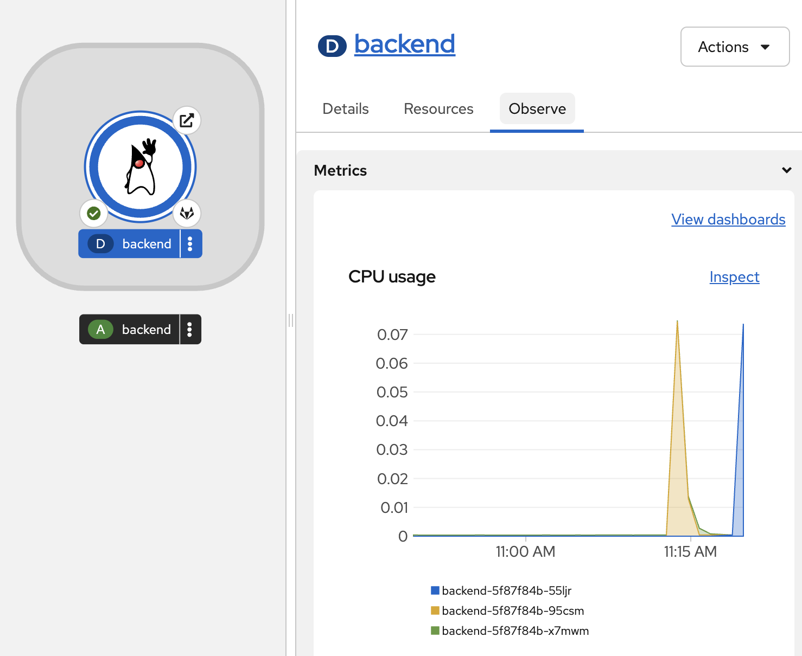

- back to web terminal, input 'ctrl-c' to terminate load test command
  
- wait 5 minute, autoscaled will reduce pod to 1. **(if you don't want to wait autoscale down to 1 pod, you can remove HorizontalPodAutoscaler and manual scale down to 1 by yourself.)**

  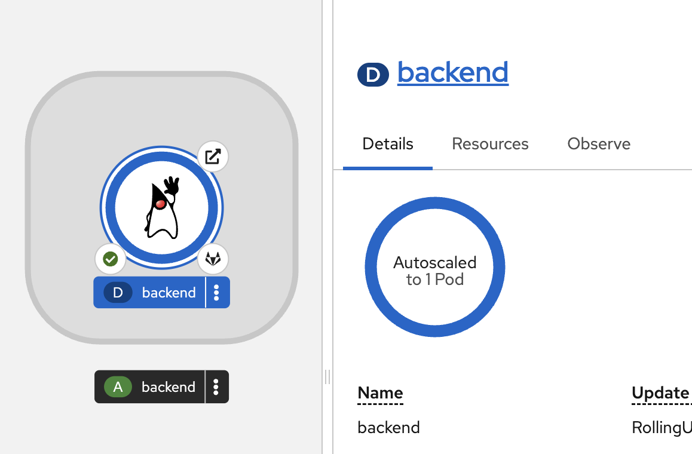
  
- remove HorizontalPodAutoscaler, go to backend deployment information page, select action menu, select remove HorizontalPodAutoscaler

  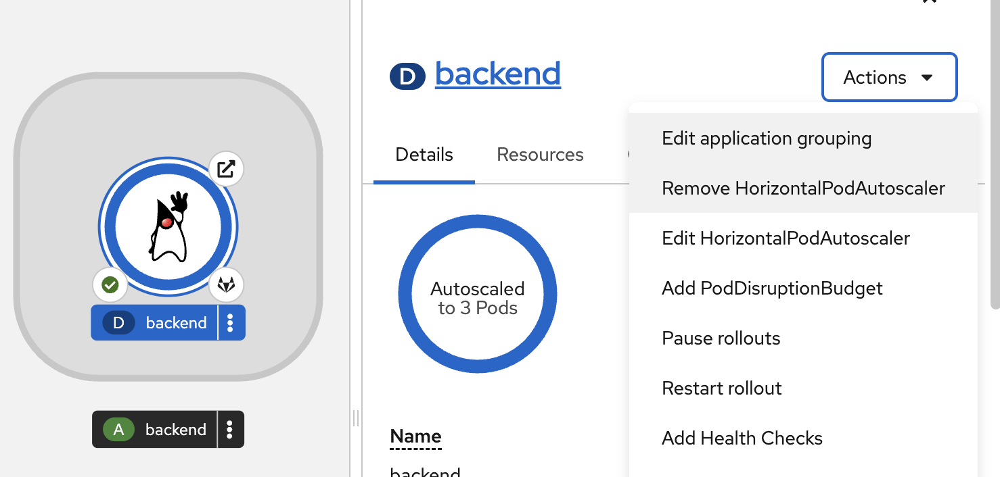   

- confirm Remove, and wait until backend change to manual scale

  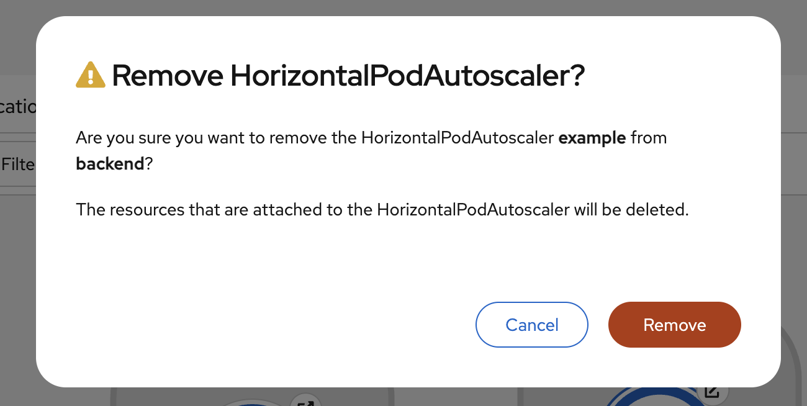

- **Optional: if you don't want to wait autoscale down to 1 pod, you can remove HorizontalPodAutoscaler and manual scale down to 1 by yourself.**
  

## Back to Table of Content

- [Red Hat OpenShift Service for AWS (ROSA) Workshop](../README.md)

