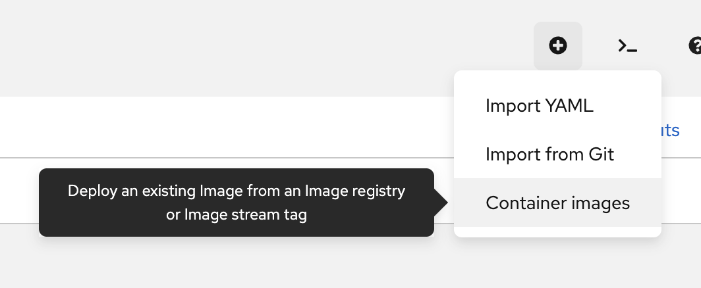
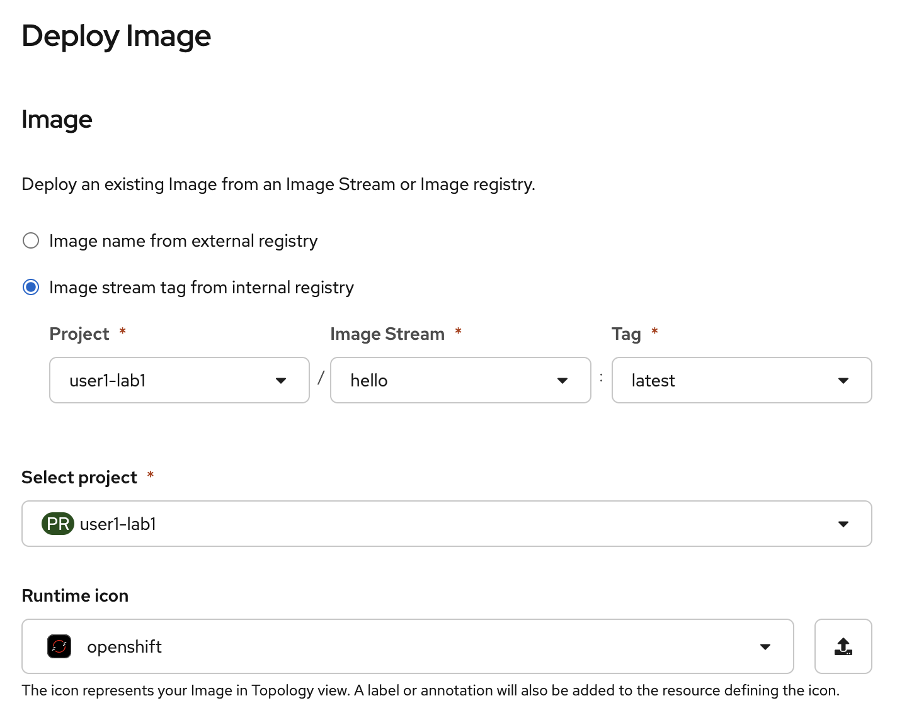
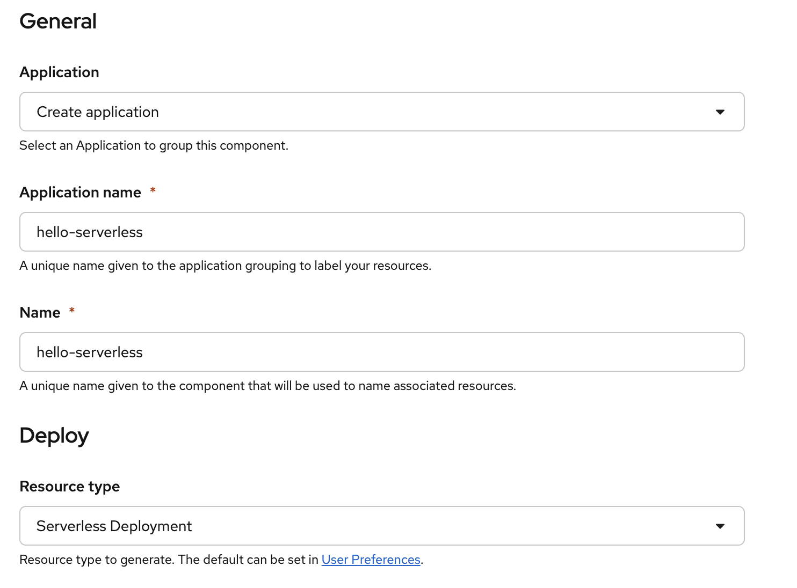
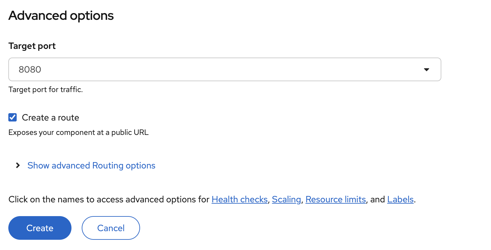
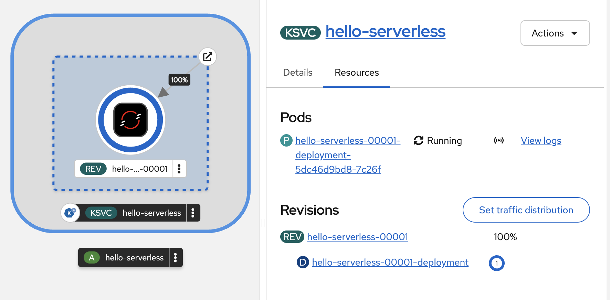
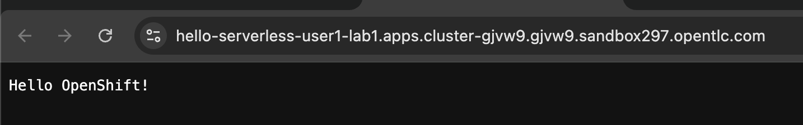
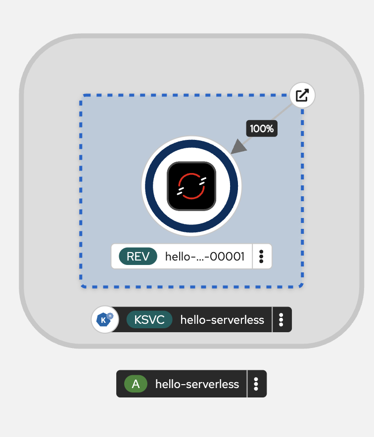
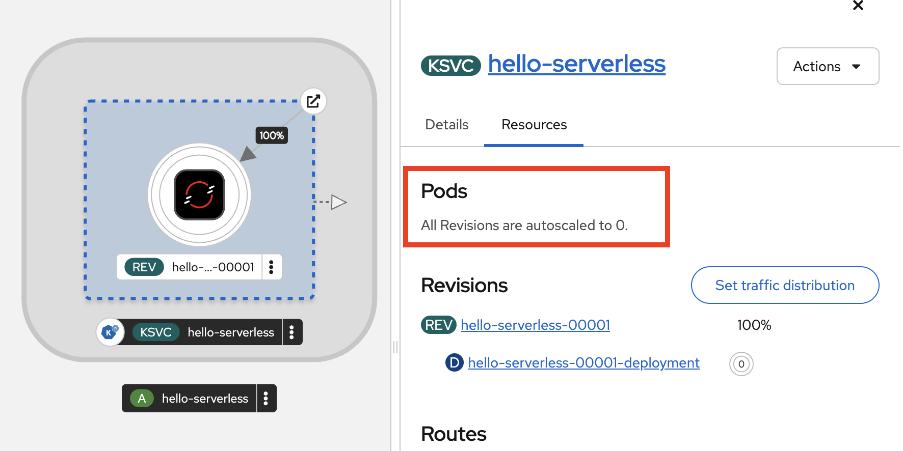
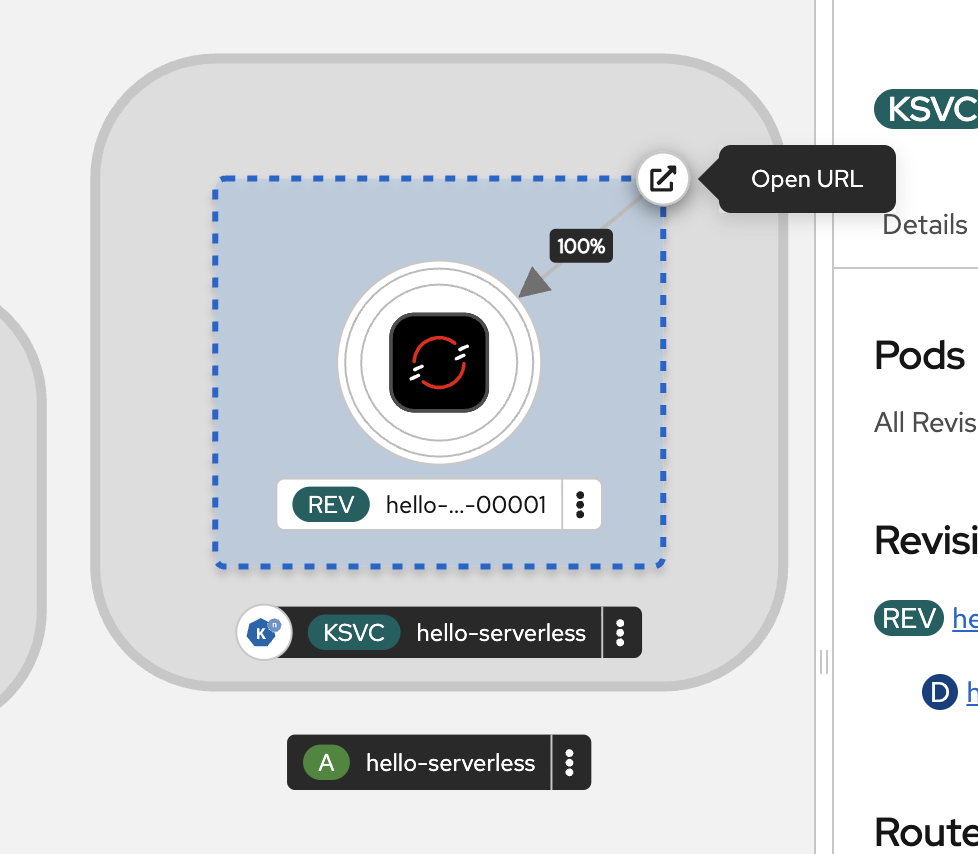
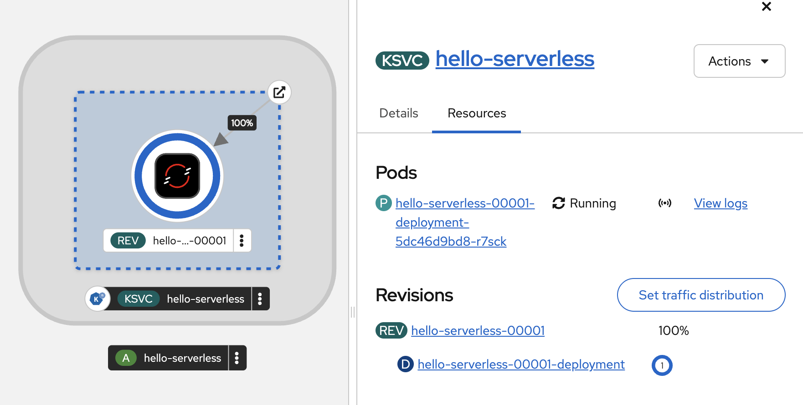

# OpenShift Serverless, auto scale up & down by event
<!-- TOC -->

- [OpenShift Serverless, auto scale up \& down by event](#openshift-serverless-auto-scale-up--down-by-event)
  - [Serverless Deployment](#serverless-deployment)
  - [Back to Table of Content](#back-to-table-of-content)

<!-- /TOC -->

## Serverless Deployment

- From Topology view, go to top right, click plus icon, select Container images

  

- In Deploy Image, select Image stream tag from internal registry

- select Project : `user1-lab1`

- select Image Stream : `hello`
  
- select Tag : `latest`   

- select project : `<username>-lab1`

- set Runtime icon : `openshift` 

  

- In General section, set Create application

- set Application Name : `hello-serverless`

- set Name : `hello-serverless`
  
- In Deploy, set Resource type : `Serverless Deployment`   

  

- Leave default in other section. click Create.

  

- wait until deploy complete, click KSVC `hello-serverless`

  

- test hello-serverless application click route icon to open application in new tab
  
  

- wait until application auto scale down (1 minute)

  

- in topology view, no pod start and deployment show 0 pod 

  

- test call application again by click route, serverless will automatic start pod.

  

  

## Back to Table of Content

- [Red Hat OpenShift Service for AWS (ROSA) Workshop](../README.md)

